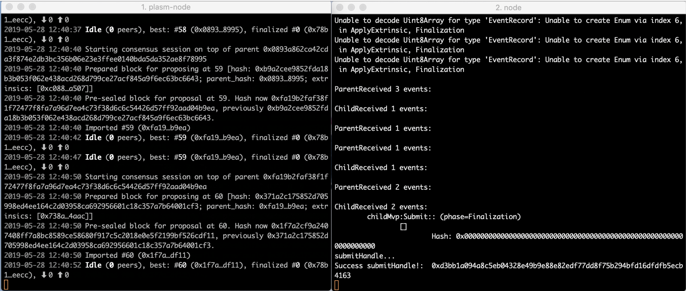

# PlasmでPlasmaチェーンをつくる


次にPlasmを使ってPlasmaチェーンを作ってみましょう。Plasmaチェーンとは親チェーン（Parent chain）と子チェーン \(Child  chain）の2つで成り立つ階層構造を指します。


今回の章で見るものはこちらです。

* [Plasma MVP の実装](https://github.com/stakedtechnologies/Plasm)
  * Plasm Parent : 親チェーンのロジックを持つ。
  *  Plasm Chlld : 子チェーンのロジックを持つ。
  *  Plasm Utxo/Merkle : Plasma におけるトランザクションを管理するためのデータ構造。
* [Plasma Client の実装](https://github.com/stakedtechnologies/plasm-client)
  * Plasm Util : 上記のチェーンの Endpoint を呼び出すためのラッパー関数群
  * Plasm Operator : 親チェーンと子チェーンを監視して適切にdeposit/exit を行うためのオペレータ。
  * Plasm Cli : 上記のチェーンの Endpoint を呼び出すための簡易CLIツール。
  * Plasm Wallet : 上記のチェーンを使って送金、出金、入金ができる Wallet デモアプリケーション。

Wallet デモアプリケーションを実際に手元で動かしながら中で何が動いているかを見てみます。

## Step1 <a id="927a"></a>

**Plasm** 本体を GitHub 上から Clone します。

```text
> git clone https://github.com/stakedtechnologies/Plasm.git
> cd Plasm
> git checkout v0.2.0
```

## Step2 <a id="cb97"></a>

 **Plasm Node** を build して実行します。これで Plasm が提供する Plasma 機能が搭載されたノードを起動することが出来ます。今回は簡単のため一つのノードが親と子両方の役割を担うことにします。

```text
> cargo build
> ./target/debug/plasm-node --dev
```

## Step3 <a id="e492"></a>

別のターミナルを開いて **Plasm Client** を GitHub 上から Clone します。

```
> git clone https://github.com/stakedtechnologies/plasm-client.git
```

```text
> cd plasm-client
> git checkout v0.2.0
```

## Step4 <a id="f428"></a>

**Plasm Operator** を起動します。Operator は親/子チェーンを監視して deposit/exit が実行された際に書くチェーンに適切な処理を行い、子チェーンのルートハッシュを親チェーンに刻むことをします。

```text
> cd packages/operator
> cp ../../env.sample .env
> yarn install
> yarn start
```


以上によりデモを行う準備が整いました。 ターミナルに以下のようなログが出力されていれば成功です。



Plasm Operator では親/子チェーンが発行するイベントをキャッチしてそれぞれについて以下の処理を行います。

**親チェーンについて**

* Submit イベントを受け取った時、子チェーンを Commit する。（子チェーンの履歴を finalize する。）親チェーンの Submit イベントは子チェーンが親チェーンに Submit イベントを投げたときに発行される。
* Deposit イベントを受け取った時、子チェーンのオペレータアカウントから Deposit をしたユーザに子チェーン上で送金する。Deposit イベントはユーザが親チェーンに Deposit 命令をしたときに発行される。
* ExitStart イベントを受け取った時、子チェーン上で Exit に使った UTXO を削除する。ExitStart イベントはユーザが親チェーンに ExitStart 命令をしたときに発行される。

子チェーンについて

* Submit イベントを受け取った時、親チェーンに子チェーンのルートハッシュを Submit する。子チェーンの Submit イベントは子チェーン上で定められたブロック周期ごとに発行される。（今回は5回に1度）

## **Step5** <a id="c4df"></a>

**Plasm Wallet UI Demo Application** を起動する。別のターミナルを開き plasm-client のルートディレクトリに移動して以下を実行する。

```text
> cd packages/wallet
```

```text
> cd packages/wallet
> yarn install
> yarn dev
```


その後、ブラウザで [localhost:8000](http://localhost:8000/) にアクセスする。  
Wallet アプリケーションを用いて、チェーン間で資金を移動する手順を見てみましょう。

## アカウントの登録\(Wallet\) <a id="9027"></a>

まずは、デモで使用するアカウントを登録します。 デフォルトの設定ではオペレータのURIは //Alice になっているので少なくとも Alice は確定で登録します。あとの名前は適当で構いません。seed に “//URI”, name に好きな名前を入れて Create を押すことで登録することが出来ます。


## 親チェーンでの送金\(Send Funds @ ParentChain\) <a id="c123"></a>

次に、オペレータである Alice から Bob, Tom に対して親チェーンのコインを送金します。from/to に事前に先程登録したアカウント名を入力し amount で送金する額を決めます。Send を押すとトランザクションが親チェーンに発行されて成功すると右のようになります。アカウント名の横に表示されているのは “ParentBalance” は親チェーンで保持しているコインの量、”ChildBalance” は子チェーンで保持しているコインの量になります。現状はトランザクション手数料を親チェーンのコインから差し引いているので Deposit, Exit をする際にかならず親にコインを持っている必要があります。


Send tokens from Alice to Bob. You can send from Alice to Tom as well.

## 親から子に Deposit \(Deposit coins from ParentWallet to ChildWallet.\) <a id="040e"></a>


いよいよ、親チェーンから子チェーンに資金を移します。今回は Bob が 5000000 だけ子チェーンに Deposit したとします。Send を押してトランザクションが受理されるとまず ParentBalance が減少し、しばらく経ってから ChildBalance が反映されることに注意してください。これはオペレータが親チェーンのイベントを監視して子チェーンに対してトランザクションを実行しているからです。（表示されているコインの更新のタイミングが名前を変更した時であることにも注意してください。）


Deposit \(Parent to Child\)

## 子チェーンでの送金（Send Funds @ ChildWallet） <a id="b4a3"></a>


続いて子チェーンでの送金を試みます。親チェーンで送金を行う時と同様に from/to に登録したアカウント名、 amount に送金量を入力し Send を押すとことで送金することができます。今回は先程 Bob が Deposit した 5,000,000 のコインのうち 1,000,000 コインを Tom に送金してみましょう。


1,000,000 units from Bon to Tom.

## 子から親に Exit①（Exit coins from ChildWallet to ParentWallet.） <a id="9e58"></a>


先程した送金した子チェーン上のコインを親チェーンに Exit します。アカウント名を入力するとそのアカウントが持っている UTXO のリストが表示されます。子チェーンではコインの履歴を UTXO ベースで保持しており、Exit も UTXO 単位で行います。任意の量のコインを Exit したい時は UTXO を分離\(自分に Exit したい量だけ送金するする\)ことで可能になります。Exit したい UTXO の ExitStart を押すことで Exit を開始することができます。


Press the ExitStart button so that you can exit your tokens to the parent chain.


しかし、これをしただけではまだ親チェーン上にコインは送られません。デモ上では ExitStart してから 60 秒間がチャレンジ\(不正申告\)の受付期間となり、それが過ぎた後に次で説明する ExitFinalize を行うことでようやく親チェーンへの Exit が完了します。

## 子から親にExit②（ExitFinalize ChildWallet to ParentWallet.） <a id="57bc"></a>

子チェーンから親チェーンへの Exit を Finalize します。from にアカウント名を入力すると、現在 Exit 中の UTXO のリストが表示されます。このハッシュ値には \(TxHash, OutIndex\) のタプルのハッシュ値が用いられています。最終的に右のように Tom のコイン量を確認すると親チェーンのコインが増えていることが確認できたら成功です。微妙にコインが減っているのは手数料の影響です。  


Then,

Exit successful!! Awesome!!

以上が Plasm を用いたデモアプリケーションの説明、そして Plasm プロトタイプで出来ることの説明になりました。

## Future Works <a id="3e6d"></a>

### ver0.2.0rc1 <a id="7fba"></a>

親チェーンと子チェーンを独立して実装します。  
デモ中では親と子チェーンを簡単のため同じチェーン上で実演していましたが、これは手数料のロジックがデフォルトの balances SRML を用いてるからです。 PlasmUtxo SRML に手数料ロジックを実装することで親と子チェーンの完全な分離を行います。

### ver0.5.0 <a id="a68c"></a>

Polkadot の TestChain に接続します。

### v0.7.0 <a id="d1e0"></a>

Plasma Cash に対応する予定です。

### v1.0.0 <a id="3f94"></a>

Plasma Chamber に対応する予定です。

### Another Importance Task <a id="c62e"></a>

ExitGame のテストを実装する予定です。

## Contact <a id="7da1"></a>

If you have a question, feel free to ping me on Twitter or on Riot \( @sate:matrix.org, @sota:matrix.org\)

